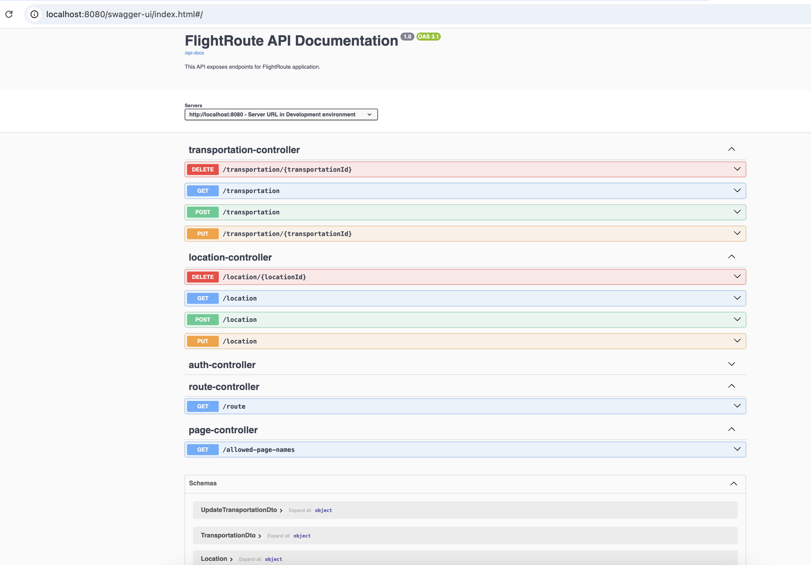

# FlightRoute

- An aviation web application.
- App user defines transportations and locations.
- Using routes page on UI all possible rotes from location A to B cen be detected.

# BE
- This project is BE of FlightRoute application.
- A rest API implemented with SpringBoot

#  FE
- You can reach FE of FlightRoute application from https://github.com/yusufarslanalp/FlightRoute-React

## Swagger UI
http://localhost:8080/swagger-ui/index.html#/

## Postman Collection
- https://github.com/yusufarslanalp/FlightRoute/blob/main/FlightRoute.postman_collection.json

